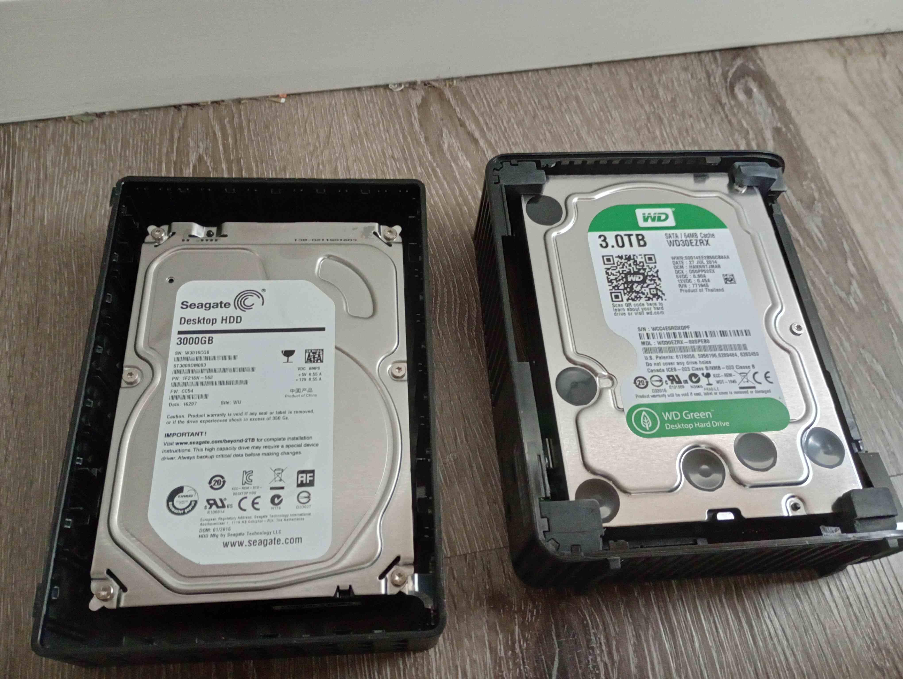
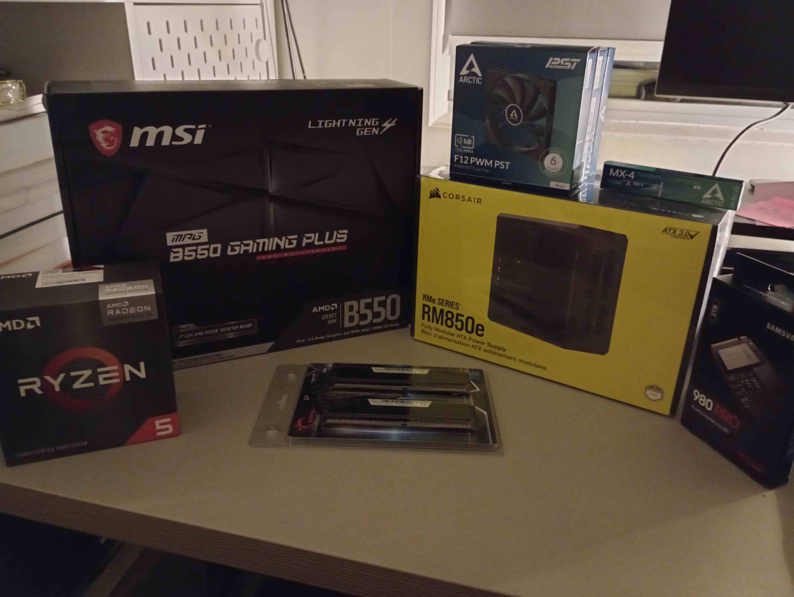
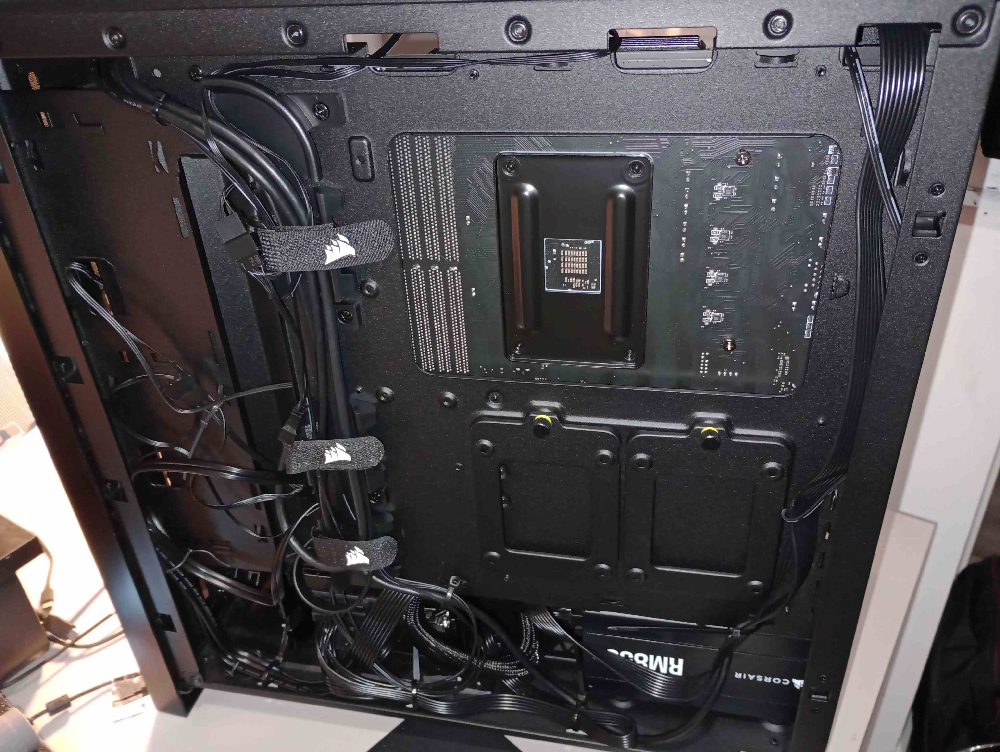

---
categories:
- computing
- nlp
date: '2023-12-21T19:33:39+11:00'
image: computer.jpg
title: Building a Deep Learning Computer for AU$2000
format:
  html:
    toc: true
---

Building a reliable Deep Learning workstation for around AU$2,000 is achievable even for beginners.
In my case, I constructed a PC with a used RTX 3090, a 6-core 3.9GHz CPU, 32GB of RAM, and a 2TB SSD for approximately AU$2,200.
    This setup allows me to prototype applications, train 1 billion parameter language models, perform inference and parameter efficient fine-tuning on models with up to 7 billion parameters, making it suitable for learning, inference applications, and basic research.
Although it may not build the largest cutting-edge models, it offers ample capabilities for its intended purposes.

As a first-time builder, I found the process overwhelming and filled with concerns, including potential hardware damage, overheating, and purchasing defective components.
However, my worries were mostly unfounded as the overall experience turned out to be relatively smooth, resulting in a system that I'm happy with.

In this article, I will discuss the reasoning behind my component choices, the assembly process, and installation.
As a novice computer builder, my choices might not be optimal; nevertheless, I hope this account proves helpful for those in similar situations.

# Rent vs Own

Why own a Deep Learning machine when you can rent one on demand from a service like AWS or [Lambda Labs](https://lambdalabs.com/service/gpu-cloud)?
They charge you only when they're in use, they handle all of the infrastructure and maintenance, and let you switch to more intensive resources as required.
However they can end up more expensive in the long run, require time to manage switching (or else be faced with bill shock), and are less convenient to use.

Cloud GPUs are the best way to start with Deep Learning, but with enough use it can become cheaper to buy.
Cheap or free web notebook based solutions like Google Colab, Kaggle Notebooks, and Paperspace Gradient are a great way to get started with Deep Learning with little investment, but they're a bit clunky to use and limit the kinds of GPU you can use.
The next step up is with large or specialist cloud providers where you pay by the hour for storage and by the month for pricing (Full Stack Deep Learning has a large [list of cloud GPU prices](https://fullstackdeeplearning.com/cloud-gpus/).
With a local setup you have to pay the upfront cost of buying the components and the cost of electricity which is relatively cheap.
If we assume a fixed utilisation, the percentage of time each month we use the machine, we can find the break-even point between the cloud and local.
For example I paid AU$2200, and electricity costs about AU$0.3 per kWh, and expect a maximum power draw of about 500W so at 15% utilisation it would cost AU$16.20 per month.
An [AWS g5.2xlarge](https://aws.amazon.com/ec2/instance-types/g5/) with an A10 is slightly worse than what I've built (looking at [GPU benchmarks](https://lambdalabs.com/gpu-benchmarks)), which costs US$1.20 per hour on demand plus US$0.08 per GB-month of storage; if we choose a 300GB volume that's around US$150 a month, or around AU$220; so the break even point is around 11 months.
Even if we went with a low cost provider like [Jarvis Labs](https://jarvislabs.ai/) with a comparable A5000 instance at spot pricing of US$0.4 per hour, paying US$0.1 per GB-month of storage, we'd pay US$75 per month and break even in just under 2 years.
This is definitely picking the sweet spot of performance and price for owning locally; for an A100 or H100 instance it's very expensive to replicate at home.

Owning a deep learning computer gives up the flexibility of choosing different instance types for the convenience of having something always available.
A great advantage of cloud computing is you can easily scale up and down compute resources, and I will still use them for tasks that require a large GPU or many GPUs.
However there's a lot you can do on a single consumer GPU, including [Training a Language model in a day](https://arxiv.org/abs/2212.14034), and its convenient to have a machine you can just turn on.
With on-demand cloud computing instances can be unavailable when someone else is using them, you have to wait for them to boot, deal with the lag of connecting them over a remote server, and remember to turn them off when they're not being used or face bill shock.
I sometimes only have a short period of time to do run something and all the friction of cloud instances means I get less done, all the while thinking about how to keep costs low (including deleting instances if I don't need them for a while).

In the end there are benefits to both renting and owning, but having spent a few years in deep learning having a computer is a great benefit for both cost and convenience for learning and prototyping.

# Choosing parts for a build

If you've decided to get a local computer you need to work you want it to do, and then what should go into it.
I wanted to a computer that could train and run NLP models with hundreds of millions of parameters, that was quiet enough to sit under my desk, was easy for a beginner to put together, and cost around $2000, and I'm happy with the result.
If you want more detail I recommend Tim Dettmers [hardware guide to deep learning](https://timdettmers.com/2018/12/16/deep-learning-hardware-guide/) which has a lot of great guidelines despite being several years old.
The most valuable tool in building a PC is [PC Part Picker](https://au.pcpartpicker.com) which I used to view compatible products, read reviews, compare with other builds, and do price shopping (including looking at historical prices) - it made the whole process *much* simpler.
Here's the [components I chose](https://au.pcpartpicker.com/user/deeploaning/saved/#view=MYj4NG):

| Component    | Selection                                                | Price        |
|--------------|----------------------------------------------------------|--------------|
| GPU          | PNY XLR8 RGB GeForce RTX 3090 24 GB Video Card (Used)    | $1200.00     |
| CPU          | AMD Ryzen 5 5600G 3.9 GHz 6-Core Processor               | $209.00      |
| Motherboard  | MSI MPG B550 GAMING PLUS ATX AM4 Motherboard             | $134.12      |
| Power Supply | Corsair RM850e (2023) 850W 80+ Gold Modular Power Supply | $155.00      |
| Memory       | G.Skill Ripjaws V 2 x 16 GB DDR4-3200 CL16 Memory        | $105.00      |
| Storage      | Samsung 980 Pro 2 TB M.2-2280 PCIe 4.0 X4 NVME SSD       | $178.55      |
| Case         | Corsair 4000D Airflow ATX Mid Tower Case                 | $126.00      |
| Case Fan     | ARCTIC F12 PST 53 CFM 120 mm Fan (x4)                    | $32.00       |
| **Total**    |                                                          | **$2139.67** |

Another option is buying a pre-built computer if it meets your specifications and cost, but it's hard to beat a custom build.
For example at the time of writing Nebula PC had [a deal](https://www.ozbargain.com.au/node/820452) where you could get a computer with comparable specifications but with a 4070 Ti and a much better CPU than I had for $2135 (after upgrading the RAM, PSU, and SSD).
A 4070 Ti is comparable in inference performance to a 3090, and much better in 8 bit, and more energy efficient, but slower for training and only has 12GB of VRAM which has often been a bottleneck for me and so I preferred the used 3090.
A year before writing Aftershock PC had a deal for a [very similar build to mine](https://www.ozbargain.com.au/node/740601), but with a new 3090 Ti for $3199, which even if it was still available would have been out of my price range.
I did also search for used builds (even to take parts from), but found they generally seemed overpriced and not quite fit for what I needed.
While it could have been convenient to have a built product (and to have some warranty on the GPU), I did find the process of building the computer gave me a deeper understanding of what is in the computer, and a lot more confidence if I ever need to modify it down the line.

## GPU

The most important, and expensive, component of a Deep Learning PC is the GPU.
Tim Dettmers has a very thorough [guide to GPUs](https://timdettmers.com/2023/01/30/which-gpu-for-deep-learning/) which you should definitely read.
The most important choice for me was to buy a used RTX 3090 on ebay.

For working with transformers I wanted an NVIDIA GPU that had at least 11GB of VRAM which left only a few consumer cards.
CUDA is still the most reliable compute platform for Deep Learning and until ROCm catches up that means I need NVIDIA GPUs.
NVIDIA segments their market between GeForce cards for gaming (which is [banned from data centres](https://www.datacenterdynamics.com/en/news/nvidia-updates-geforce-eula-to-prohibit-data-center-use/)) and more expensive higher performance GPUs for data centres.
This means that where their performance intersects the GeForce cards are much cheaper; e.g. a RTX 4090 is around AU$3000, but a significantly worse A10 is around AU$5000.
It's barely worth considering server GPUs, although you can get older models such as M40, P100, and K80 with lots of VRAM (but much lower bandwidth, clock speed and fewer tensor cores) if you can work out where to store and cool cards designed for server racks.
For the NVIDIA cards the options are the RTX cards listed in the table below; only the 40 generation cards can be bought new.

| Card    | New or Used | VRAM | 16 Bit Training ([Dettmers](https://timdettmers.com/2023/01/30/which-gpu-for-deep-learning/#Raw_Performance_Ranking_of_GPUs)) | Cost  |
|---------|-------------|------|-------------------------------------------------------------------------------------------------------------------------------|-------|
| 2080 Ti | Used        | 11GB | 0.7                                                                                                                           | $600  |
| 3080 Ti | Used        | 12GB | 0.9                                                                                                                           | $800  |
| 3090    | Used        | 24GB | 0.9                                                                                                                           | $1200 |
| 3090 Ti | Used        | 24GB | 1.0                                                                                                                           | $1500 |
| 4070    | New         | 12GB | (Missing)                                                                                                                     | $900  |
| 4070 Ti | New         | 12GB | 0.7                                                                                                                           | $1200 |
| 4080    | New         | 16GB | 1.0                                                                                                                           | $1800 |
| 4090    | New         | 24GB | 1.4                                                                                                                           | $2800 |

Buying a used RTX 3080 Ti on ebay is the best value for money for performance, and a RTX 3090 on ebay for VRAM.
Buying used GPUs does carry some risk, and Linus Tech Tips has a [video on buying used GPUs](https://www.youtube.com/watch?v=UFytB3bb1P8) which I found helpful, but for me the cost savings outweighed the risk.
The problem with in-person marketplaces like Gumtree and Facebook Marketplace is you want to test the GPU is working before you hand over your money, but also meet somewhere you both feel save exchanging close to $1000 of value, and this is very difficult in practice.
I like ebay because it has buyer protection so strong that sellers complain about it; if you don't get what you paid for and can work it out in 30 days then you're likely to get your money back.
The ebay auction system is also an efficient way to price these kinds of goods - watch some auctions for a while to gauge the actual price people pay when the good is actually sold, they tend to fall within a 20% band of some price (which I estimated above).
I eventually bought my card when one came up with a "Buy it Now" price at the top of my range, I could have paid a little less with more patience.
The card I got was as described and passes benchmarks, so I'm happy with the outcome, although if it does die I have no recourse.

I did consider supporting a 2 GPU setup but settled on only having a single GPU.
Having 2 GPUs has lots of benefits, it allows you to use them for two independent things, or split models and data across them for a speed up.
However even having a build that could support 2 RTX 3090s is difficult because you need a more expensive motherboard, case and power supply that can fit them.
You also need to keep them both cool; Tim Dettmers suggests blower style GPUs but they're much noisier and harder to find.
In the end it would make the build too difficult and expensive, but it would have been fun.

## Everything else

Given that we're spending $800-$1200 on a used GPU we need a CPU, motherboard, Power Supply, RAM, disk storage, and case that fits them within $800-$1200 to meet the budget.
From my experience the biggest concerns are running out of RAM and and disk storage, and picking all the other components to be mid-range compatible.
A lot of these decisions were made using PC Part Picker; using it to find compatible components, sorting by price to find the cheapest ones, and looking at components with a few reviews or builds to make sure I could get support and they had been used together before.

For a CPU I wanted something mid-range, with a few cores (but not too many since I mostly run Python single threaded), with integrated graphics.
I wasn't sure whether I could run a monitor and CUDA off the same GPU, and so I looked for CPUs with integrated graphics; I don't think it was necessary but it did mean that I could set up my PC while I was waiting for a GPU on ebay.
After some research it seemed like the best value for money with integrated graphics was in the Ryzen 5 series, and the Ryzen 5 5600G fit the bill at just over $200 (about $30 more than the 5600X which isn't bad for a GPU); apparently you can even [run stable diffusion on it](https://old.reddit.com/r/Amd/comments/15t0lsm/i_turned_a_95_amd_apu_into_a_16gb_vram_gpu_and_it/).
There's a lot of talk in PC building around CPU coolers, but from what I read unless you're overclocking the stock AMD Wraith cooler is fine (and that has been true for me), seeing it in some pre-builds gave me the confidence not to worry about it.

Once a CPU was selected I wanted a compatible motherboard that was going to support all the parts but not cost too much.
Filtering through items with reviews on PC Part Picker by price it seemed like the B550 boards met my needs (but may need a BIOS upgrade to support Ryzen 5), but [not all cheap B550 motherboards are the same](https://www.tomshardware.com/features/cheap-AMD-b550-motherboards-tested).
Once I'd done my research and picked a motherboard I waited around for a deal and got a similar one for much cheaper.

The power supply had to be able to supply enough current to power my whole system, which PC Part Picker estimated at 580W.
I picked a larger power supply and not-the-cheapest because I'd heard of people having issues with GPU power spikes.
In the end a 750W and 850W power supply were very close in price, so I got the slightly more expensive one, but this wouldn't be enough to power a second GPU.

For RAM I wanted as much as I could afford that matched the clock speed of my CPU without large cache latencies.
I actually have no idea how important that is, but it didn't make a big difference in price so it seemed like the safe thing to do (and you could buy *much* more expensive RAM).
Ideally I would have gone with 2 sticks of 32GB ram, which would have only cost twice as much, but I was pushing on the budget already and decided it was easy to upgrade later, and so stuck to a minimum of 2 sticks of 16GB ram (since I want at least as much RAM as VRAM).

Datasets and models for deep learning can get pretty big so I wanted lots of storage, with some fast storage for loading model weights.
I overspent on the Samsung 980 Pro when I would have been fine with a slightly slower and cheaper M2 SSD, but I think 2TB is plenty of storage.
For some additional storage I shucked two 3 TB external hard drives I had from their cases (with some guidance from YouTube).

For picking a case I wanted something large and easy to build in and that had good cooling for the GPU.
The Corsair 4000D is both of these, very popular, and quite cost effective and so I went with that.
The RTX 3090 is a large GPU and so it was good seeing some builds on PC PartPicker with this case and GPU together.

# Building the PC

Once I'd bought all the components I needed to put them together, and with the help of YouTube I managed to successfully do this over a few days.
I found the Linus Tech Tips [How to Build a PC](https://www.youtube.com/watch?v=BL4DCEp7blY) particularly useful, and while it covered a bunch of exotic hardware I didn't use, it gave some great tips like installing the components on top of the motherboard box and powering it up before putting it into the case.

Overall it took me about 5 sets of 4 hour sessions to build the PC, doing each step slowly.
The first session was plugging all the components into the motherboard (except for the GPU which I hadn't bought yet) and verifying it could boot.
The second session was putting the motherboard into the case and handling cable management.
The third session was configuring the bios and installing the operating system.
The fourth session was shucking the hard drives (following some YouTube videos) and inserting them into the case.
The final session was putting in the GPU, installing CUDA, and testing it.

## Assembly

I ran into some hiccups in assembling the computer but managed to work through them all:

* I couldn't find the case screws, but watched an unboxing video to discover they were inside the disk drive bay
* I forgot to flash a new BIOS to the motherboard before installing components, but got lucky and found it already had a new enough BIOS. If it had gone the other way I would have had to remove everything from the motherboard, flash the BIOS, and install them again
* I bought thermal paste for the cooler, not realising it already came pre-applied
* It took a while to seat all the screws for the CPU Cooler, and at one point I removed it *and the CPU came out with it*, bonded by the thermal paste. I was terrified I had bent a pin and broken the CPU, but luckily it booted fine the first time
* On my first boot only one stick of RAM was detected; it turned out the other stick just wasn't properly inserted

## Installation and software

Once the computer booted I [set the XMP profiles](https://www.pcgamer.com/what-are-xmp-profiles-and-how-do-i-use-them/) in the BIOS and installed [Lubuntu](https://lubuntu.me/) which I've used for a while on low-resource machines, and everything worked well.
My main concern was to check that the used GPU was correctly performing.

When I got the GPU I ran the [unigine Superposition benchmark](https://benchmark.unigine.com/superposition) on 1080 Extreme and found that the GPU temperatures didn't get about 75C (which is great), but I got a score of 10870 which was right at the bottom of [their leaderboard](https://benchmark.unigine.com/leaderboards/superposition/1.x/1080p-extreme/single-gpu/) for RTX 3090.
However the majority of systems are running it on Windows using Direct X; the closest Linux comparisons I could find were a RTX 3090 with 11049 and a RTX 3070 with 7657, so it's in the right ballpark.

Since I'm going to be using it for Deep Learning I wanted to run some Deep Learning benchmarks, so I [installed CUDA](https://docs.nvidia.com/cuda/cuda-installation-guide-linux/index.html) and ran some transformer benchmarks.
I found a repository [benchmarking transformers](https://github.com/eugeneware/benchmark-transformers) and got 1:47 per epoch, which was slightly faster than their reported 1:54 per epoch.
I did have to update all the dataset links to the latest in the [GLUE dataset](https://gluebenchmark.com/tasks) and choose a compatible version of [PyTorch 1.8](https://pytorch.org/get-started/previous-versions/) with CUDA 11, but it shows it's ballpark right.
I then ran [Lambda Labs Benchmark](https://lambdalabs.com/blog/nvidia-rtx-4090-vs-rtx-3090-deep-learning-benchmark) and found that it gave results very close to their benchmarks, and the temperature did not get above 71C during training, so I'm pretty sure it's good.

| GPU                         | SSD | BERT Base SQUAD | BERT Large SQUAD | GNMT  | NCF      | ResNet50 | Tacotron2 | TransformerXL Base | TransformerXLLarge | Waveglow |
|-----------------------------|-----|-----------------|------------------|-------|----------|----------|-----------|--------------------|--------------------|----------|
| RTX 3090 FP16 (Lambda Labs) | 236 | 172             | 52               | 86080 | 25118176 | 905      | 25018     | 22863              | 7821               | 97100    |
| RTX 3090 FP16 (Mine)        | 237 | 173             | 53               | 86138 | 25176430 | 910      | 24480     | 22960              | 7845               | 97803    |
| RTX 3090 FP32 (Lambda Labs) | 144 | 85              | 24               | 44869 | 14714953 | 513      | 25350     | 12101              | 4165               | 97404    |
| RTX 3090  FP32 (Mine)       | 145 | 86              | 25               | 45105 | 14677988 | 514      | 25021     | 12103              | 4180               | 97703    |

# Conclusion

Building a PC for Deep Learning tasks can be a complex yet rewarding experience.
With careful component selection and attention to detail during assembly, it is possible to create a powerful and efficient machine tailored to specific needs.
I feel like I have a much better understanding of the components that go into a computer now and am more comfortable adjusting my system in the future.
Now I'm off to do some Deep Learning.
